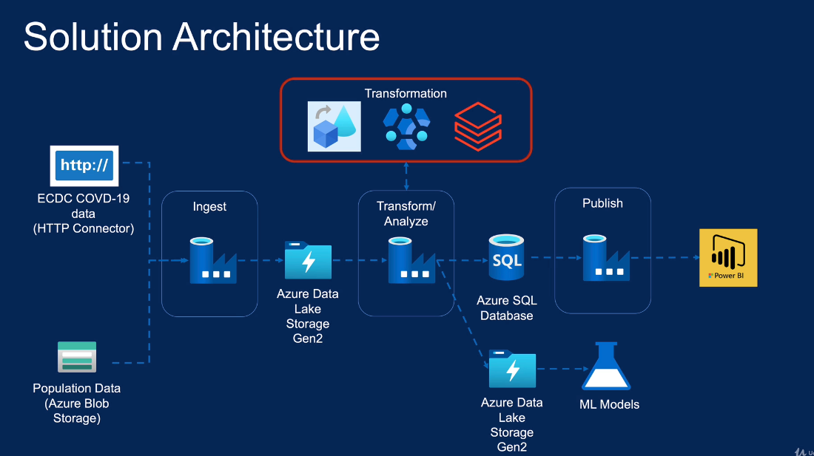

# Section 1: Introduction

## 1. Course Introduction
Azure blob storage, Azure Data Lake Gen2, Azure SQL, Azure Databricks, HDInsights, Power BI, Azure DevOps, Azure Key Vault

## 2. Course Structure
flow of cource structure

## 3. Course slides Download
https://github.com/cloudboxacademy/covid19

# Section 1: Overviews

## 4. Azure Data Factory Overview

### What is Azure Data Factory

A fully managed, serverless data integration solution for ingesting, preparing and transforming all of your data at scale.

transformation is very critical task in ADF so we use databricks

Fully Managed Service - microsoft managed all the management for your data factory, we dont need to wrorry about VM's, take care of scalebility, availablity and security requirements for our data factory
Serverless - It runs on a serverless infrastructure, our compute environments can be scale to any data size without infrastructure management
Data Integration Service - from multi cloud, onprimse and Saas solutions
Data Transformation Service - code free development tool
Data Orchestration Service - Orchestrate workflow from start to finish. It provides excellent monitoring capabilty to monitor datapipeline.

### What Azure Data Factory is Not

Data Migration Tool
Data Streaming Service 
Suitable for complex Data Transformation
Data Storage Service

## 5. Project Overview

Covid-19 Prediction/Reporting 

Data Lake - Data Lake to be built with the following data to aid Data Scientists to predict the spread of the virus/mortality
Confirmed cases, Mortality, Hospitalization/ ICU Cases, Testing Numbers, Country's population by age group

Data Warehouse - It is to be built with the following data to aid Reporting on Trends 
Confirmed cases, Mortality, Hospitalized/ ICU Cases, Testing Numbers 

Data Sources - ECDC Website
confirmed cases, Mortality, Hospitalized/ ICU Cases, Testing Numbers 
EuroStat Website - population by age

## 6. Solution Architecture Overview

Transformation - data flow with in Data Factory, HDInsights, Databricks 
Blob Storage - it stores large amount of binary and text data.
Azure Data Lake Storage Gen2 - enterprise level dataset -petabytes of data while sustaining 100Gb of throughput. This built on top of Azure Blob storage,it is cost effective , better management, and security. You can mount ADLG2 with databricks , hadoop and azure synaps.

for data warehouse - Azure SQL,
synaps analytics we can use for large dataset

## 7. Azure Storage Solutions Overview

Key Factors to consider

Structure of the data - 
1. Structured - Row - Columner 
2. Semi - Structured - JSON, XML, YML
3. UnStructured - Audio , Video, Photos, Media , Docs

Operational Needs 
How often is the data accessed?
How quickly do we need to serve?
Need to run simple queries?
Need to run heavy analytical workload?
Accessed from multiple regions?

Azure Databases
1. Azure Sql database
2. Azure Database for MYSQL
3. Azure Database for PostgreSQL
4. Azure Database for MariaDB
5. VM Images with Oracle,SQL Server etc.

Azure Storage Account
1. Blob Storage - unstructred data - text file, media, documents, pdf.
2. File Storage - fully managed cloud file stores that can access from anywhere by SMP protocol 
3. Disk Storage - sotres Virtual Machine Disk on Azure VM's
4. Table Storage - stores structured Data in te form of key value pair
5. Queue Storage -  that can be used to store and retrieve messages from the queue.

Azure Data Lake
enhanced performance ,enhanced management, better security

Azure Data Lake Storage Gen2 - This solution has been designed to service multiple petabytes of information while sustaining hundreds of gigabytes of throughput. This is built on top of the Blob Storage with additional features,such as enhanced performance for big data analytics and support for Hadoop compatible workload, enhanced management with its hierarchical namespace,better security using POSIX permissions on folders and files. As it's built on Blob Storage, it's also inexpensive to run.

Azure Cosmos DB
Globally distributed, Multi Model, High Throughput

 It is another storage solution offered by Azure. Cosmos DB is a fully managed NoSQL database for modern application development. It's globally distributed,which allows us to elastically scale throughput and storage across any number of Azure regions.It supports a number of APIs to access the data such as SQL API, Cassandra, MongoDB, and Gremlin APIs.It provides near real-time response times for a variety of data. Typical applications that benefit from Cosmos DB are,web, mobile gaming,or IOT applications.Those need to handle massive amounts of data reads, writes, global scale with a near real-time response.So far, we've seen a number of storage solutions,amongst those, we will be using the following storage solutions in our project.

Storage Solutions Used in this course
1. Azure SQL Database - this will be used as our reporting platform for Power BI.So, once we process the data in our data lake,we load them into Azure SQL Database and Power BI will report from there.
2. Azure Blob Storage - this will be used as a data source for one of our data sets. Also, we'll keep our scripts and config files in this.
3. Azure Data Lake Storage Gen2 - this is our data lake for our project.

## 8. Useful Links & Resources

ECDC Website for Covid-19 Data - https://www.ecdc.europa.eu/en/covid-19/data

Euro Stat Website for Population Data - https://ec.europa.eu/eurostat/estat-navtree-portlet-prod/BulkDownloadListing?file=data/tps00010.tsv.gz

Lecture: Azure Storage Solutions

Introduction to Azure Storage services - https://docs.microsoft.com/en-us/azure/storage/common/storage-introduction
Azure SQL Database - https://docs.microsoft.com/en-us/azure/azure-sql/database/sql-database-paas-overview
Azure Synapse Analytics - https://docs.microsoft.com/en-us/azure/synapse-analytics/overview-what-is
Azure Cosmos DB - https://docs.microsoft.com/en-us/azure/cosmos-db/introduction
Azure Data Lake Storage Gen2 - https://docs.microsoft.com/en-us/azure/storage/blobs/data-lake-storage-introduction

# Section 3: Environment Set-up

## 9. Environment Set-up - Module Overview
Azure Subscription
Data Factory
Blob Storage Account
Data lake Storage Gen2
Azure SQL Database 
Azure Databricks Cluster 
HD Insight Cluster

## 10. Creating Azure Free Account

https://azure.microsoft.com/en-us/pricing/purchase-options/azure-account

## 11. Azure Portal Overview

https://portal.azure.com/#home

## 12. Creating Azure Data Factory

https://learn.microsoft.com/en-us/azure/data-factory/concepts-data-flow-overview#available-regions

while creating Data factory - git configuration - select configure git later 

resource group - covid-reporting-rg
resource name - covid-reporting-adf

create ADF and then pin in dashboards and enter inside data factory

## 13. Creating Azure Storage Account

Storage Account

resource group - covid-reporting-rg
storage account name - covidreportingsa

performance - Standard - general purpose v2 account
Redundancy - Locally - redundant storage (LRS)

it contains 

IAM - you can allow users to RBAC to your containers
Data Storage - contianers, file shares, Queues, Tables 
Access Keys - 
Storage Browser

## 14. Installing Azure Storage Explorer

you can upload folders as well as individual files, you can see all your storage account at one place

https://azure.microsoft.com/en-us/products/storage/storage-explorer#Download-4

## 15. Creating Azure Data Lake Storage Gen2

ADLG2 - it is build on top of standard storage account which contains additional features such as heriarchical namespace, fine grained securtiy, compatibility with bid data workloads.

Storage Account

resource group - covid-reporting-rg
storage account name - covidreportingdl

performance - Standard - general purpose v2 account
Redundancy - Locally - redundant storage (LRS)

Enabled hierarchical namespace - enabled

## 16. Creating Azure SQL Database

SQL Database

resource group - covid-reporting-rg
data base name - covid-db

server - create new - covid-srv
authentication method - Use SQL Authentication
Server admin login - admin
Password - 
Confirmed Password -> then Ok

SQL elastic pool - No
Workload Environment - Development
Compute and Storage - configure and change 
    Service Tier - Basic (For less demanding workloads) -> apply
Backup Storage Redundancy - Locally-redundant backup storage
Connectivity method - public endpoint
Allow Azure service and resource to access tier - Yes
Add current client IP Address - Yes
Connectivity Policy - Default

Review + create

Contains - 
price tier- Basic
Compute + Storage -
Query editor

Developers tool -  Azure Data Studio and SQL Server Management Studio,

## 17. Installing Azure Data Studio

https://learn.microsoft.com/en-us/azure-data-studio/download-azure-data-studio?view=sql-server-ver16%5C&tabs=win-install%2Cwin-user-install%2Credhat-install%2Cwindows-uninstall%2Credhat-uninstall

## 18. Useful Links & Resources

Lecture: Creating Azure Free Account

Free Account - https://azure.microsoft.com/en-gb/free/
Students Free Account - https://azure.microsoft.com/en-gb/free/students/

Lecture: Azure Portal Overview

Azure Portal - https://azure.microsoft.com/en-gb/free/students/

Lecture: Creating Azure Data Factory
https://docs.microsoft.com/en-gb/azure/data-factory/quickstart-create-data-factory-portal

https://learn.microsoft.com/en-us/azure/data-factory/concepts-data-flow-overview#available-regions

Lecture: Creating Azure Storage Account
https://docs.microsoft.com/en-us/azure/storage/common/storage-account-create?tabs=azure-portal

Lecture: Installing Azure Storage Explorer
https://azure.microsoft.com/en-us/products/storage/storage-explorer

Lecture: Creating Azure Data Lake Gen2
https://docs.microsoft.com/en-us/azure/storage/blobs/create-data-lake-storage-account

Lecture: Creating Azure SQL Database
https://docs.microsoft.com/en-us/azure/azure-sql/database/single-database-create-quickstart?tabs=azure-portal

Lecture: Installing Azure Data Studio
https://learn.microsoft.com/en-us/sql/azure-data-studio/download-azure-data-studio?view=sql-server-ver16\

# Section 4: Data Ingestion from Azure Blob

## 19. Data Ingestion from Azure Blob - Module Overview